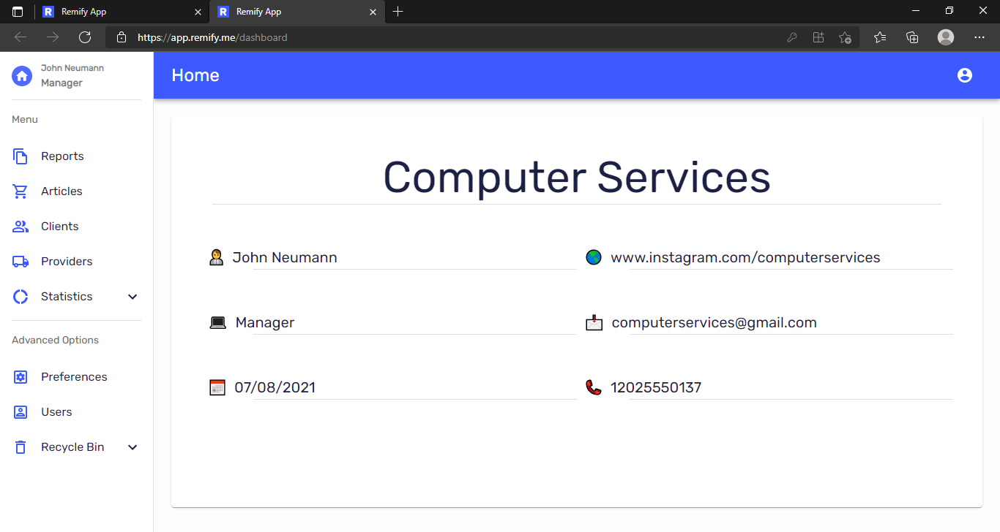
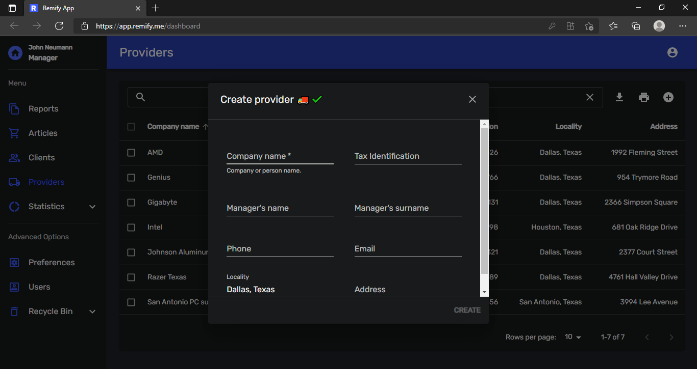
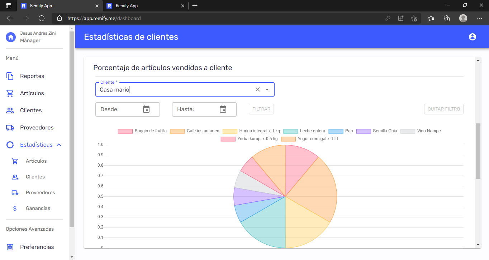
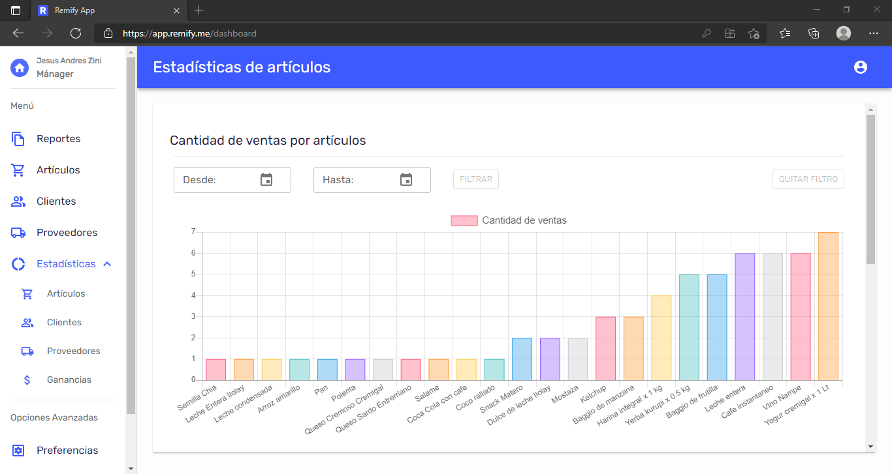
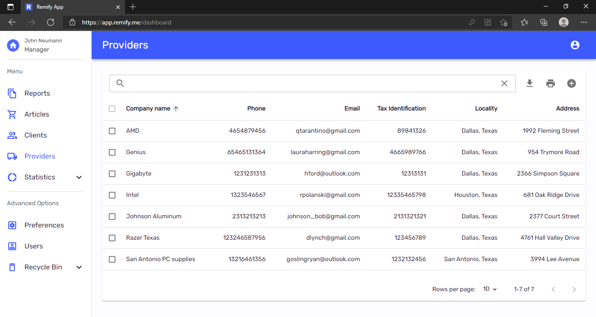
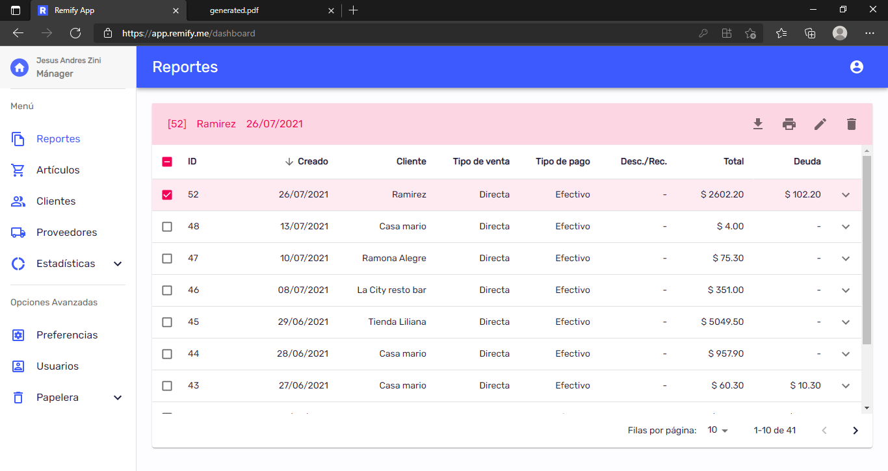
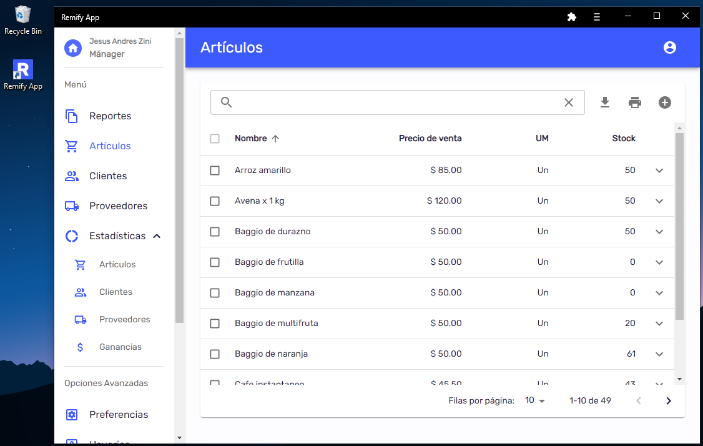
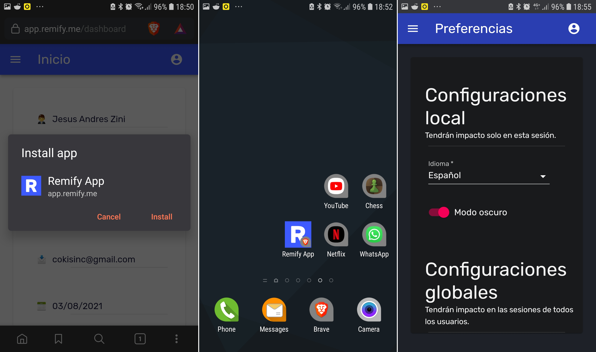
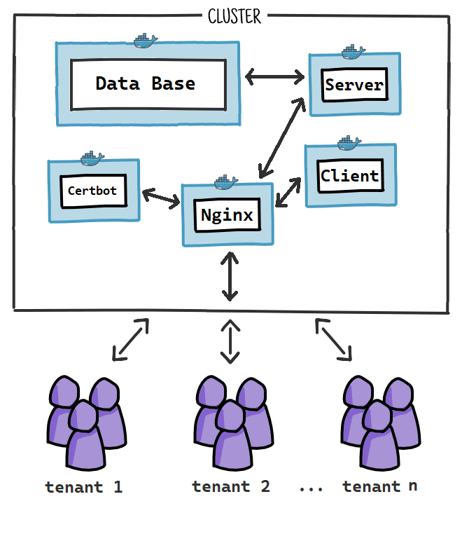

## Remify App 👨‍💼💼

SaaS webapp for business management.
Available in three languages (english, spanish and portuguese)

- [app.remify.me](https://app.remify.me/)

- I'll be updating this repo soon

## Stack used 💻

- Node
- Express
- Typescript
- PostgreSQL
- React
- Redux-Toolkit
- Material-UI
- Docker
- Docker-Compose
- Nginx

## Images 📷

