## Remify App 👨‍💼💼

SaaS Multi-Tenant Web App (PWA) for business management. Available in three languages (English, Spanish and Portuguese)

## Stack used 💻

### Operations

- Docker 🐳
- Docker-Compose
- Nginx Server/Reverse Proxy
- Let's Encrypt Certbot
- Ubuntu Linux VPC
- Bash Scripting
- CloudFlare
- DigitalOcean
- SonarQube code analysis 

### Development

- Node
- Express
- Typescript
- React
- Redux-Toolkit
- Material-UI

### Database

- PostgreSQL
- PL/PgSQL

## Some features ⚙️

- Invoice printing with jsPDF
- Caching with Redis
- Authentication with Passport JWT
- Tests with Mocha.js and Supertest

## Images 📷

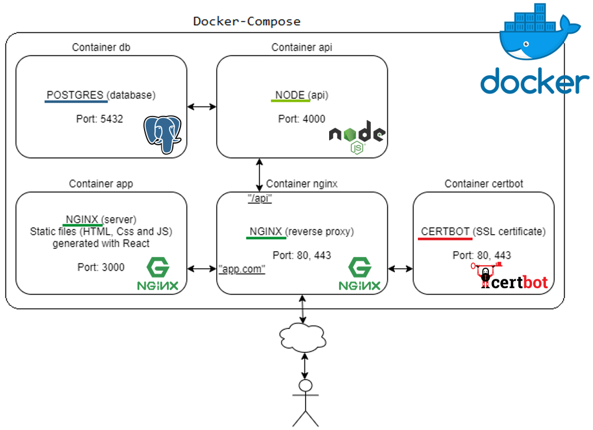

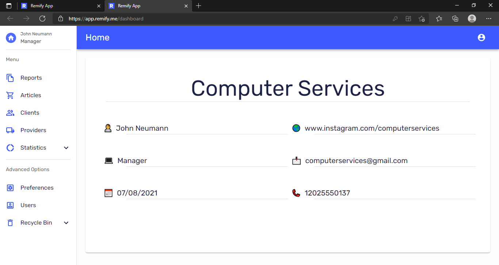

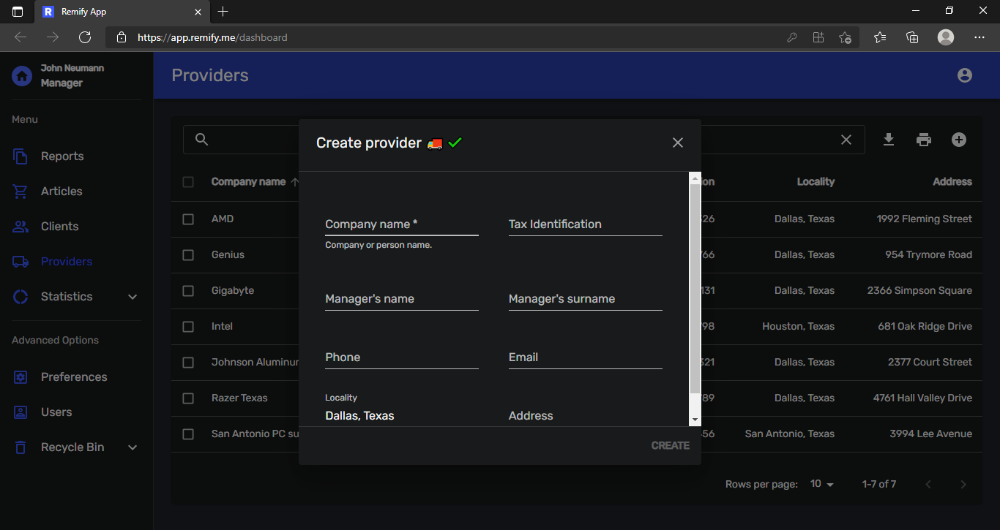

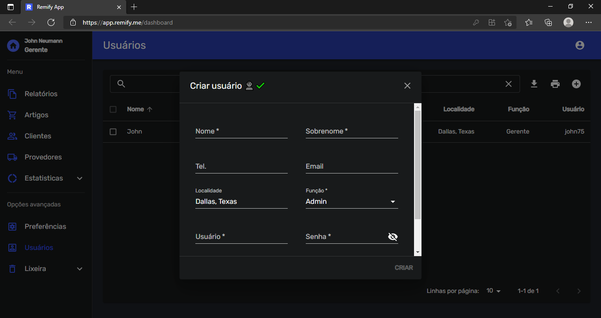

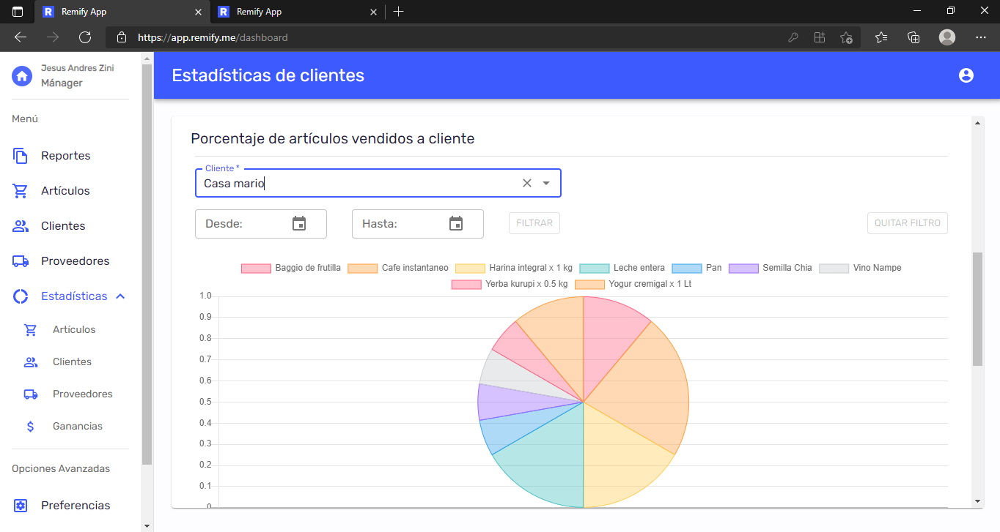

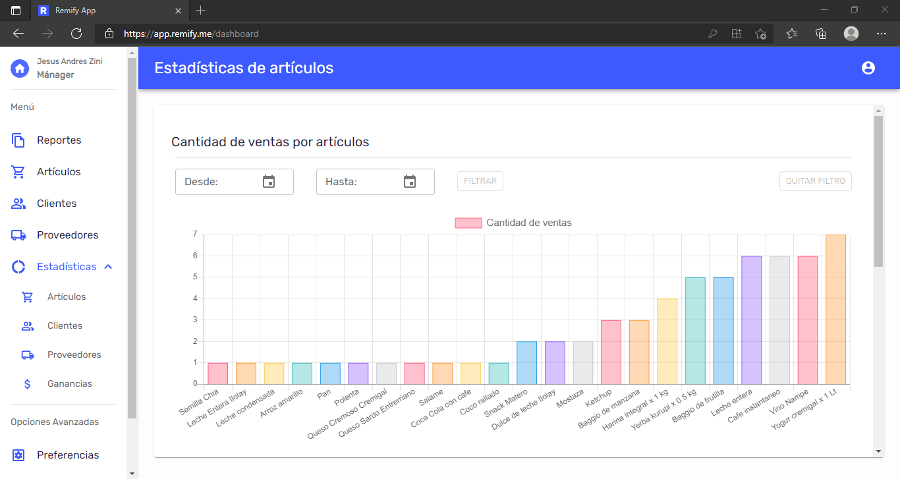

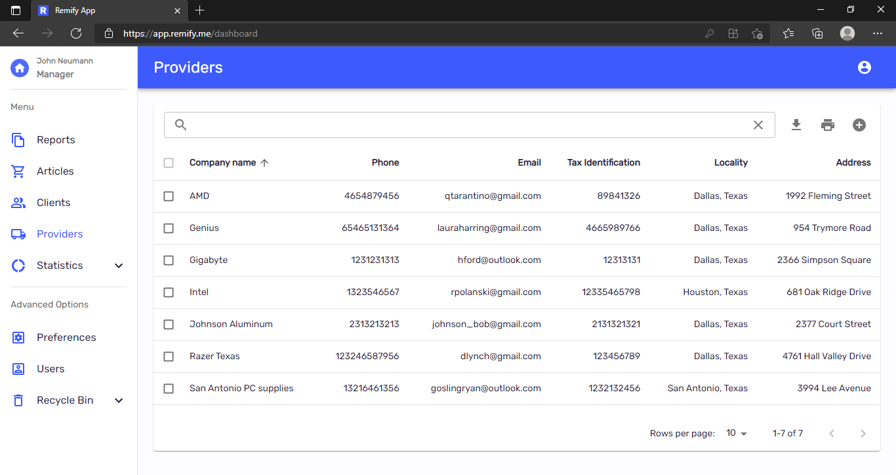

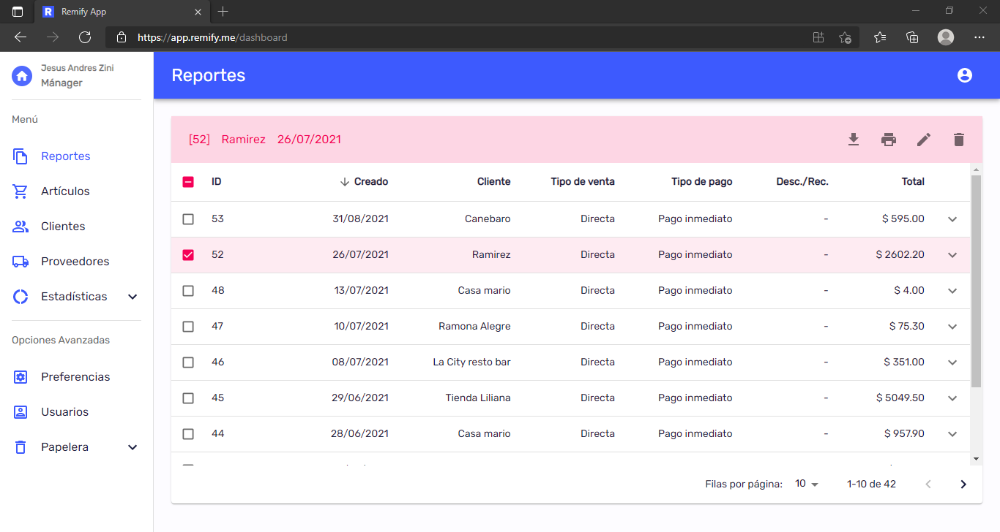

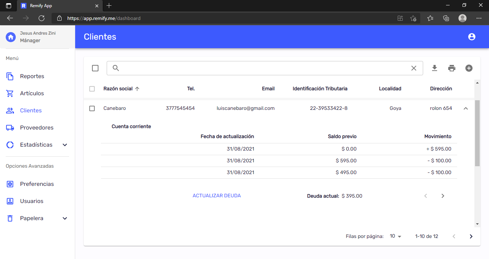

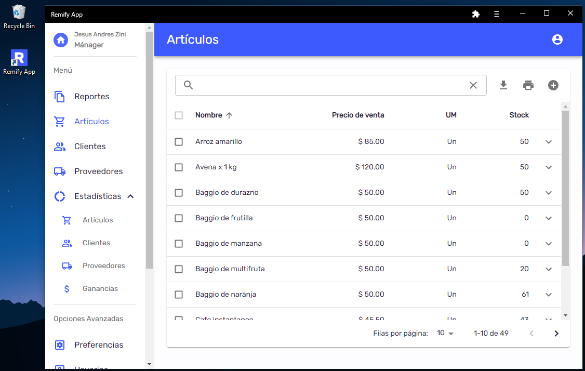

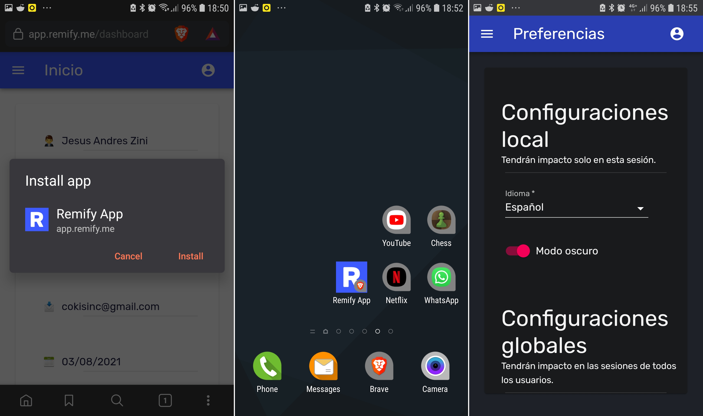

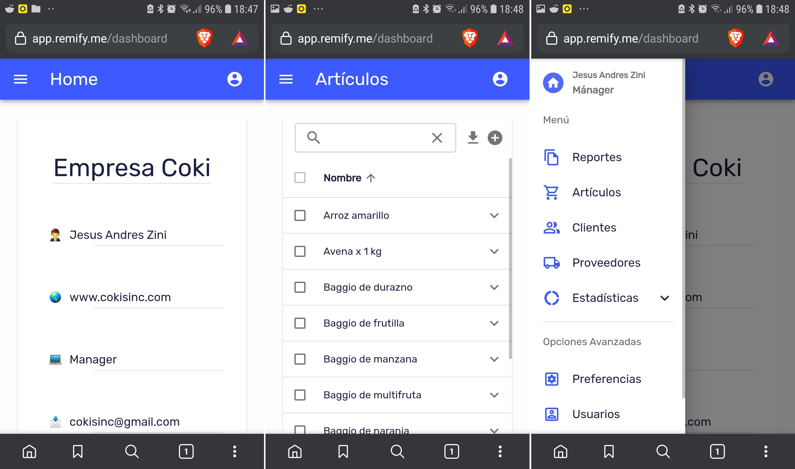
